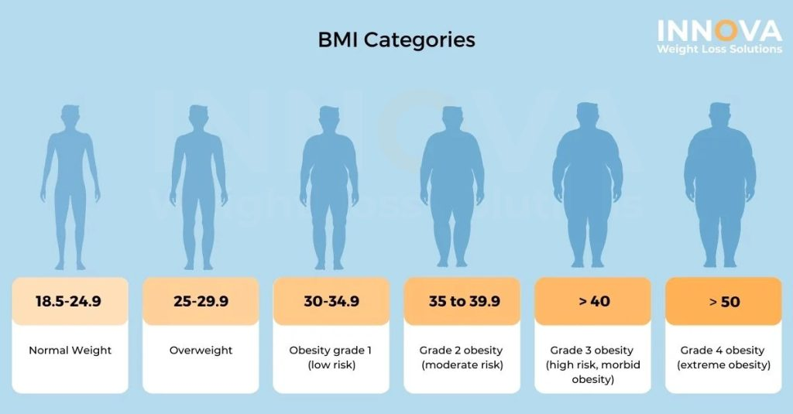

# IDS702_Project_Group_5


# Unveiling Obesity Dynamics: Interactions Between Lifestyle and Genetic Factors

## Project Overview
This project explores the intricate relationships between genetic predispositions and lifestyle factors in determining obesity outcomes. Specifically, it focuses on:

1. The interaction between family history of overweight and physical activity frequency on Body Mass Index (BMI).
2. The combined effects of meal frequency and alcohol consumption on obesity levels.

The analysis leverages a dataset containing demographic, dietary, and lifestyle factors from individuals in Mexico, Peru, and Colombia. Using advanced statistical methods, the study highlights key insights for targeted obesity prevention and management strategies.

---

## Key Features
- **Dataset**: Utilizes the Obesity Levels dataset from Kaggle, comprising 2,111 records.
- **Methods**:
  - Multiple Linear Regression (MLR) to examine BMI predictors.
  - Ordinal Logistic Regression to analyze obesity levels.
- **Visualizations**:
  - Histograms, boxplots, and interaction plots for exploratory data analysis.
  - Scatterplots for interaction effects.
- **Findings**:
  - Physical activity significantly reduces BMI for individuals with a family history of overweight.
  - Frequent meals combined with alcohol consumption are strongly associated with higher obesity levels.

---

## Installation and Setup
1. Clone the repository:
   ```bash
   git clone <https://github.com/cathylyirang/IDS702_Project_Group_5.git>
   ```


---

## Project Structure
- **data/**: Contains the dataset used for the analysis.
- **notebooks/**: Jupyter notebooks with exploratory data analysis and model development.
- **src/**: Python scripts for data preprocessing, modeling, and visualization.
- **results/**: Outputs of the analysis, including plots and model evaluation metrics.

---


## Results Summary
### Research Question 1: Interaction Between Family History and Physical Activity on BMI
- **Key Finding**: Physical activity leads to significant BMI reduction in individuals with a family history of overweight. The interaction effect was statistically significant (p < 0.001).

### Research Question 2: Interaction Between Meal Frequency and Alcohol Consumption on Obesity Levels
- **Key Finding**: Alcohol consumption combined with frequent meals increases the likelihood of severe obesity, with an Odds Ratio of 2.86 (p < 0.001).

---


## Future Work
- Include additional measures of body composition (e.g., body fat percentage, waist-to-hip ratio).
- Use less synthetically generated datasets for more robust classification.
- Investigate additional lifestyle and genetic factors affecting obesity outcomes.

---

## References
- [Obesity Levels Dataset](https://www.kaggle.com/datasets/fatemehmehrparvar/obesity-levels/data)
- World Health Organization (WHO). Obesity and overweight. Retrieved from [https://www.who.int/news-room/fact-sheets/detail/obesity-and-overweight](https://www.who.int/news-room/fact-sheets/detail/obesity-and-overweight)

---

## Contributors
- Ilseop Lee
- Ramil Mammadov
- Tursunai Turumbekova
- Yirang Liu

---

